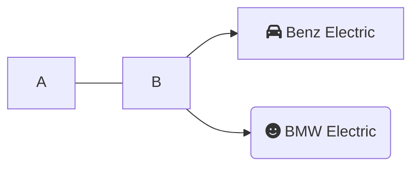

## Mermaid support in GitHub

GitHub worked with MermaidJS maintainers to add support in GitHub rendered markdown html files. Here the code blocks with "mermaid" language will be scanned by their javascript to add an iframe to display the rendered image.

